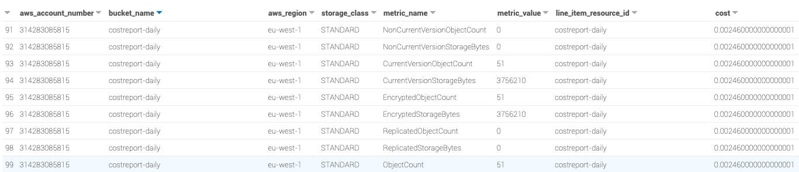

# s3_cost_overview_serverless
Tools to get cost and information for any bucket on AWS using storage Lens and Cost and usage reporting.

All backend infrastructure deployed with Terraform. 

## The challenge 

Find the most efficient way to get information about cost for each bucket in AWS.

The script or the tools will need to return these information : 

For each bucket:

- Name
- Creation date
- Number of files
- Total size of files
- Last modified date of the most recent file
- Type of storage
- Encryption type
- Extra like (life-cycle, cross-region replication, etc)
- **how much does it cost**


#### Display : 

- Ability to get the size results in bytes, kB, MB, ... 
- Ability to group buckets by regions
- Ability to group by encryption
- Ability to have full information as life cycle, cross-region replication, etc.
- Ability to get current and past version size in case of versioning

#### Filter:

- By bucket name
- By storage type (Standard, IA, RR).


## Requirement 

- Tools must work on each OS
- Easy to install and use 
- Fast and efficient, and simple
- Serverless if possible
- Infrastructure as to be deployed using Terraform

:warning: The tools need to be very fast and efficient and get the result in seconds even with millions or billions of file.


### Architecture - evaluation of the different solution

The architecture step will be to evaluate the different solution available and to analyse the pros and cons to choose the best solution available. Each solution has pros and cons. 

1. Use aws CLI or boto3 and directly query S3 (S3 API get_objects_list_v2)
   
   This is the first solution everyone will think as it's the fastest and easiest way to implement but there is a lot of limitations. 
   The drawback is :
   - slow 
   - only get result of 1000 record in one run ( require pagination or collection )
   - expensive 
   - no information about the cost
   - need to list files to get number of files and encryption % information

    comment: 
    
    You can use large EC2 and parallelism to make the result faster but it will be costly and it will still return the result in few minutes for millions of files

2. Use aws CLI or boto3 and Cloudwatch
   
   Same solution as the last one with few improvement

   Using cloudwatch you will not need to list content of buckets to get information about number of files on each bucket and type of storage but this solution will still be slow and expensive. 
   
3. Using Cost Explorer from Aws CLI or boto3 

   Limitation : Impossible to get the price by bucket, you will need to tag all your bucket with their name and you will need to get bucket information from s3 listing.
   
   
4. S3 inventory 
   
   S3 inventory need to be activate on each bucket and the destination bucket has to be in the same region. This will cover a good way to have all bucket information but there is no information about cost

5. S3 Storage Lens 
   
   This is a very good solution to get all information about all bucket on all account on each region.

   This is the big benefit, if you have an organization, you can get information for your all your bucket for all your account.

   Cons and limitation : Impossible to implement with Terraform and require to wait around 48H to be active.
   
   It will not covers the cost.

6. Cost and Usage report

   This is the perfect solution to have the cost usage by bucket. 
   
   You will not get information about the bucket itself but you can have all you need for cost usage.

   Cons and limitation : Require until 24h to be active and you can use Terraform to implement it only in us-east-1 region.  

### Architecture 

My choice after analyse of the different solution will be to use **cost and usage report and s3 storage lens** with export to parquet file on S3.
Apache Parquet file support fast data processing and is compressed, it's a lot more  more efficient than row file like csv.

This solution will cover all the need for cost and bucket information and it will be entirely serverless and it will not be expensive. Moreover, this solution is flexible and it will be possible easily to cover storage of different resource on AWS.

[AWS Cost and Usage Reports](https://docs.aws.amazon.com/cur/latest/userguide/what-is-cur.html) will create report periodically (hourly or daily) uploaded to an S3 bucket for the AWS Organizations master account.

[AWS storage lens](https://aws.amazon.com/blogs/aws/s3-storage-lens/) will create report daily uploaded to an S3 bucket for the AWS Organizations master account and 

When AWS put a new file in the cost and report or storage lens bucket an event is created that triggered a Lambda function which will run a Glue Crawler to update the database, the schema and partitions.
  
A view will be create to join the 2 tables (cost and lens) based on the bucket id.
The view will be use to organize and have better performance for our queries.

Athena will be use to query the database to get the information about our bucket and cost.

Using Athena, we will only pay when we are using the command and everything will be fully serverless and automated. 

The tools will connect to [Athena](https://docs.aws.amazon.com/athena/latest/ug/what-is.html) to make the query and return the result based on the argument we provide. 
Athena is Serverless, so you don't have to manage any infrastructure.

Moreover Athena can integrate easily to QuickSight for easy data virtualization and BI. 

Here is an overview of the infrastructure.


It's possible to control Control Query Access and Costs from workgroup in Athena. 

At the end, you will be able to query your db with Athena to have a result like that in seconds.



As it's using SQL to make the query on S3, it will easy to make parsing or grouping and moreover using Athena and workgroup, you will be able to control who is able to make the query.

### How to use the module 

```hcl
terraform {
  required_version = "~>0.14.6"

  required_providers {
    aws = {
      source  = "hashicorp/aws"
      version = "~> 3.27"
    }
  }
}

provider "aws" {
  region = "eu-west-1"
}

module "aws_s3_cost_explorer" {
  source               = "git::https://github.com/archi-jusi/s3_cost_overview_serverless.git//terraform//modules/storage"
  project              = "aws-s3-cost"
  environment          = "staging"
  namebucketcostreport = "staging-cost-bucket"
  namebucketathena     = "staging-cost-athena"
  namebucketlens       = "staging-cost-lens"
  namelensdashboard    = "dashboard-lens-staging"
  costprefix           = "cost"
  costreportname       = "costreport"
  workgroupname        = "workgroupcostathena"
  databasename         = "database_terraform"
  organization         = false
  tags = {
    env       = "staging",
    owner     = "devopshandsonlab",
    terraform = "true"
    project   = "s3_overview_cost_project"
  }
}

```
Note:

The variable cost prefix and cost reportname will be used later to create the cost and usage report. 
Unhapilly, this step will not be automate as Terraform has the feature only for us-east-1

The module will deploy 34 resources as below: 

```hcl
data.archive_file.lambda_zip_runglue
data.aws_caller_identity.current
data.aws_iam_policy.gluepolicy
data.aws_iam_policy_document.policy-document-glue
data.aws_iam_policy_document.policy-document-glue-lens
data.aws_iam_policy_document.policy-document-lambda
data.aws_iam_policy_document.policy-document-lambda-lens
data.aws_organizations_organization.organization
data.aws_partition.current
data.aws_region.current
aws_athena_database.dbathena
aws_athena_named_query.sqlcostview
aws_athena_named_query.sqljoinview
aws_athena_named_query.sqllensview
aws_athena_named_query.sqlselectglobalview
aws_athena_workgroup.workgroupcostathena
aws_glue_crawler.glue_crawler
aws_glue_crawler.glue_crawler-lens
aws_iam_policy.custom-policy-glue
aws_iam_policy.custom-policy-glue-lens
aws_iam_policy.policy-lambda
aws_iam_policy.policy-lambda-lens
aws_iam_role.gluerole
aws_iam_role.gluerole-lens
aws_iam_role.lambdarole
aws_iam_role.lambdarole-lens
aws_iam_role_policy_attachment.glue_role_attach_policy_custom
aws_iam_role_policy_attachment.glue_role_attach_policy_custom-lens
aws_iam_role_policy_attachment.glue_role_attach_policy_managed
aws_iam_role_policy_attachment.glue_role_attach_policy_managed-lens
aws_iam_role_policy_attachment.lambda_role_attach_policy
aws_iam_role_policy_attachment.lambda_role_attach_policy-lens
aws_lambda_function.lambdarungluefunction
aws_lambda_function.lambdarungluefunction-lens
aws_lambda_permission.allow_bucket_event_notification
aws_lambda_permission.allow_bucket_event_notification-lens
aws_s3_bucket.s3_backend["athenabucket"]
aws_s3_bucket.s3_backend["costbucket"]
aws_s3_bucket.s3_backend["lensbucket"]
aws_s3_bucket_notification.bucket_notification-lens
aws_s3_bucket_notification.bucket_notification_cost_report
aws_s3_bucket_public_access_block.blockbucket["athenabucket"]
aws_s3_bucket_public_access_block.blockbucket["costbucket"]
aws_s3_bucket_public_access_block.blockbucket["lensbucket"]
```

output.tf has to be set as below 

```hcl
output "information" {
  description = "output of module"
  value       = module.aws_s3_cost_explorer
}
```

and will output :

```hcl
Apply complete! Resources: 34 added, 0 changed, 0 destroyed.

information = {
  "arn" = [
    "arn:aws:s3:::staging-cost-athena",
    "arn:aws:s3:::staging-cost-bucket",
    "arn:aws:s3:::staging-cost-lens",
  ]
  "bucket_name" = [
    "staging-cost-athena",
    "staging-cost-bucket",
    "staging-cost-lens",
  ]
  "currentaccount" = "314283085815"
  "currentpartition" = "eu-west-1:314283085815"
  "currentregion" = "eu-west-1"
  "databaseforathena" = "database_terraform"
  "gluecrawler" = "aws-s3-cost-staging-crawler"
  "gluerole" = "aws-s3-cost-staging-role-glue"
  "gluerolelens" = "aws-s3-cost-staging-role-glue-lens"
  "lambdarole" = "aws-s3-cost-staging-role-lambda"
  "lambdarolelens" = "aws-s3-cost-staging-role-lambda-lens"
  "regionbucket" = [
    "eu-west-1",
    "eu-west-1",
    "eu-west-1",
  ]
  "workgroupathena" = "workgroupcostathena"
}
```

Once everything is deployed from the module with Terraform you will need to create a cost and usage report using the variable set in the module : 
- costprefix 
- costreportname

From billing, 

Create a new report, use the name you defined in the module from the variable costreportname and check the box "Include resource IDs"


Next step, select the bucket create by Terraform defined with the variable **namebucketcostreport** , set the prefix defined in the variable **costprefix**.
Select daily and Athena to use the Parquet compression.


NOTE: Once the report will be create, you will need to wait until 24h before getting the first report.

Then, for Storage Lens, as it's a quite new service, it's not possible at all to deploy from Terraform or even Cloudformation, or aws CLI and we will need to wait until 48h that the report is active.

Storage Lens will give us these information:

```
Total storage
Object count
Current version bytes
Current version object count
Noncurrent version bytes
Noncurrent version object count
Delete marker object count
Encrypted bytes
Encrypted object count
Replicated bytes
Replicated object count
Object lock bytes
Object lock object count
Incomplete MPU bytes
Incomplete MPU object count
```

To enable Storage Lens, Master account of your organization has to be used. 

By default, this terraform module is done for an organization but if you want to have this features just for the account you are using with Terraform, you can change the variable organization to false (bool). 

```hcl
module "aws_s3_cost_explorer" {
  source               = "..."
  organization = false
  ...
}
```

Let's enable this amazing [feature](https://aws.amazon.com/blogs/aws/s3-storage-lens/)

You will need to use your **master account** to enable this feature for your organization. 

First choose a name, the name has to be what you define in the variable of the module **namelensdashboard** and the bucket 

```hcl
module "aws_s3_cost_explorer" {
  source               = "..."
  namelensdashboard    = "dashboard-lens-staging"
  namebucketlens       = "staging-cost-lens"
  ...
}
```


For the Home region, choose the same region you were using with terraform.

Then, configure as below.

select Include all accounts in your organization or Limit the scope to your signed-in account if you defined the variable **organization** to false.


For the storage, select the bucket defined from variable **namebucketlens**.

Note : Select output format as Apache Parquet.

Storage Lens should be enable in the next 48h ! :smile:

Once, StorageLens and cost report are active, S3 event notification will notify Lambda which will run the glue crawler to update the Glue Data Catalog.

When everything is settle, you will be able from Athena, choosing the correct workgroup defined in the module to query each new table freshly created automatically. 

You will find few saved queries in the workgroup that you need to execute in order to create view and join table to make your queries running faster and easier.